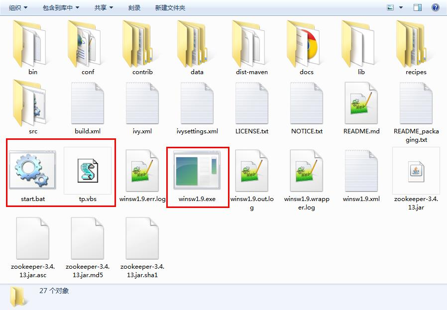
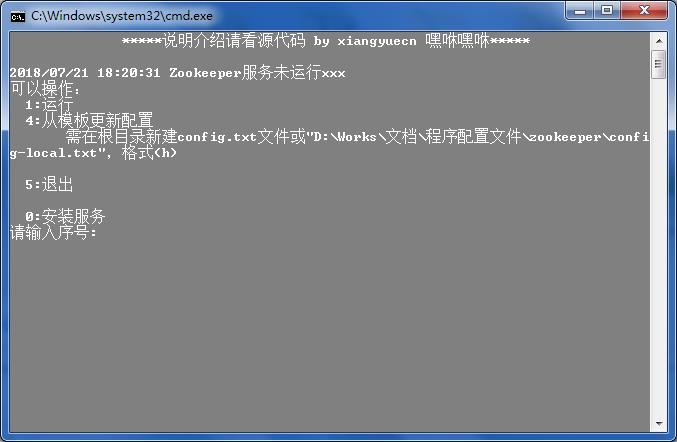
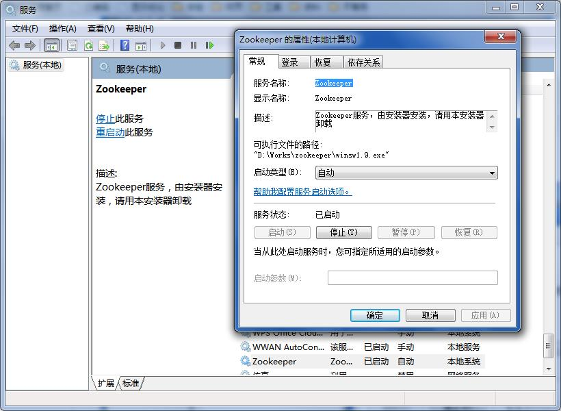
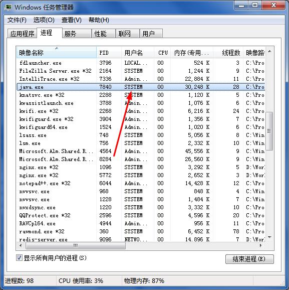

# 本工具用于Zookeeper Windows版的服务安装和管理

xiangyuecn编写，学习zookeeper之用，还没弄懂怎么配置zookeeper，先把安装问题先解决了，不然服务器一注销zookeeper也自动关掉了，首次使用于2018-07-21。

此项目基于[Ngnix Windows版的服务安装和管理](https://github.com/xiangyuecn/Nginx-Windows-Service-Manager)，更详细的介绍可以参考Nginx的这个项目。

### 使用方法

1. 把bin目录内的4个文件复制到zookeeper根目录下（和zookeeper-x.x.jar同一目录，参考图1），config.txt为可选的配置模板文件。

2. 运行start.bat进行安装/卸载Windows服务、管理服务运行/停止/重启、更新配置、重新加载配置。

# bin目录4个文件说明

### start.bat
主脚本，对zookeeper服务管理每次都运行这个脚本即可完成轻松管理；如果需要调整服务名称和配置文件名称，更改此文件即可，下面有专门介绍。

### tp.vbs
配置模板文件格式处理、日期替换更新脚本

### winsw1.9.exe
windows服务安装器，用于把zookeeper安装为系统服务，下载地址：http://download.java.net/maven/2/com/sun/winsw/winsw/ 配置介绍：https://kenai.com/projects/winsw/pages/ConfigurationSyntax。

### config.txt
配置模板文件，支持任意格式重复内容只需定义一次，任何地方引用替换，大大简化重复配置的编写（起源于Ngnix配置）；此文件不提供不影响使用。

# start.bat

文件内`配置部分`可以调整：
1. 对于config.txt模板文件并非一定要放到根目录，可以放到其他地方，通过修改configTxt定义，指向配置模板文件。
2. 配置文件名称通过confPath指定，默认为conf/zoo.cfg，如果需要改成别的文件名，修改即可。
3. 服务名称通过svs修改，默认为Zookeeper。

服务安装运行后，winsw会产生3个log文件（参考图1），可以删除，winsw1.9.xml文件不可删除，否则无法卸载和启动。

# config.txt

### 此文件内容可以和Zookeeper配置文件内容完全一致，也可以使用扩充语法，省去那些不适合手动编辑的场景
暂时没有使用场景，本功能基于Nginx项目，详细语法可以参考https://github.com/xiangyuecn/Nginx-Windows-Service-Manager

#### {y}、{m}、{d}、{h}、{M}、{s}
当前时间日期变量

#### 内容支持宏定义和替换
定义：`DEF(标识) 宏名称=宏内容 (标识)END`，宏名称支持^&、^<、^>、/、_、-、空格、换行、字母、数字、文字组合，宏内容可以多行。
使用：在需要替换的地方写上宏名称即可。

# 图例

文件组成：

安装服务：

服务管理：

已安装服务：

java进程：

